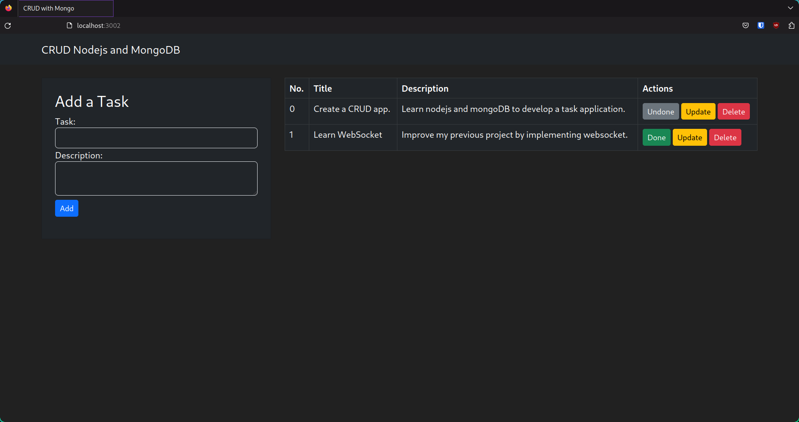

# Task App

CRUD Task App using Node.js and MongoDB in Docker containers.



## Features

- List tasks created
- Create a task
- Update task details
- Delete a task
- Mark task as done

## Installation

It requires having Docker installed.

### Get the app

Before you can run the application, you need to get the application source code onto your machine.

1. Clone the repository and move to the project directory using the following commands.

```shell
git clone https://github.com/lu1s9/crud-nodejs-mongo.git
cd crud-nodejs-mongo
```

### Run the application stack

1. Make sure no other copies of the app/db are running first (`docker ps` and `docker rm -f <ids>`)

2. Start up the application stack using the following command.

```shell
docker compose -f docker-compose.yml -f docker-compose.prod.yml up -d
```

### Test the application

1. Open your web browser and type `localhost:3002` into the address bar.

2. Fill in the form and submit to add tasks to the list. Update, delete and mark as done as needed.

3. Stop and remove containers after app usage.

```shell
docker compose down
```
